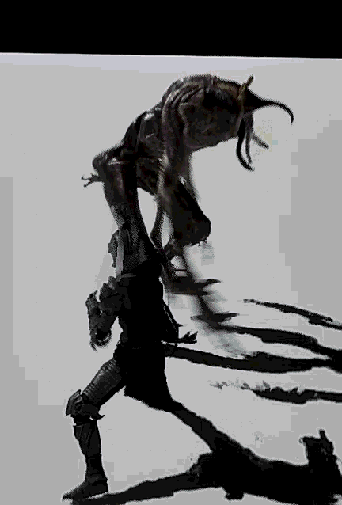
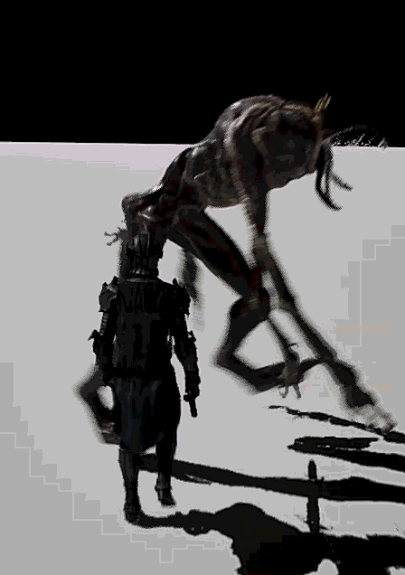
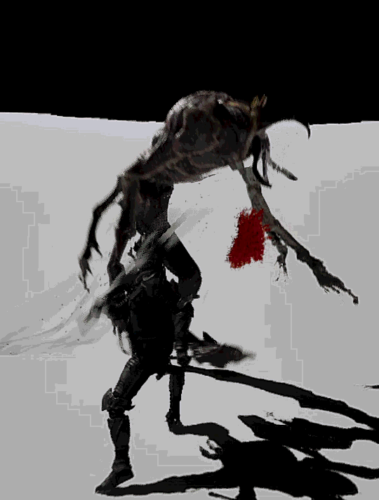
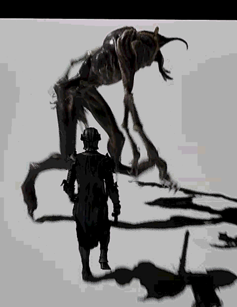

# 🗡️ Ironclad

> Unreal Engine 5 Blueprint 기반으로 히트스톱 · 콤보 시스템 · AI를 직접 구현해 **전투감** 있는 액션 게임 프로토타입을 완성한 프로젝트입니다.

---

## 📋 프로젝트 정보

| 항목 | 내용 |
|------|------|
| **개발 기간** | 2026.03.24 ~ 2026.04.08 (약 2주) |
| **팀 구성** | 1인 개인 프로젝트 |
| **장르** | 3D 솔로 액션 (DMC / 스텔라 블레이드 스타일) |
| **플랫폼** | PC (Unreal Engine 5.6) |
| **제작 방식** | Blueprint 전용 (C++ 없음) |
| **개발 스택** | Unreal Engine 5 / Blueprint / Behavior Tree / Niagara |
| **담당 업무** | 전투 시스템(콤보·히트스톱·히트 판정), AI(Behavior Tree·Perception), 애니메이션 파이프라인(Motion Matching·AnimNotify) |

---

## 🎬 시연

| HitStop | Combo L→L→L | Combo L→R→R | Combo R→L |
|---------|-------------|-------------|-----------|
|  |  |  |  |

---

## 🎯 핵심 구현

### 1. 히트스톱 시스템

**타격감은 애니메이션이 아니라 0.05~0.1초 슬로우에서 온다**는 것을 직접 검증.

- `Set Global Time Dilation`으로 히트 시 게임 속도를 일시 감속, 타이머로 슬로우 해제
- 히트스톱 + 카메라 쉐이크 + Niagara 파티클을 **동시에** 호출해야 타격감이 완성되는 구조
- 초기에는 모든 공격에 동일한 수치를 적용했으나 콤보마다 타격감이 단조로워지는 문제 발생
- DataTable에 `HitStop 지속 시간 · Dilation 강도` 컬럼을 추가해 공격마다 독립적으로 설정
  - Light Attack → 짧고 가볍게 / Heavy Attack & 런치 → 길고 강하게 차별화

| 동일 HitStop | 개별 HitStop |
|---|---|
|  |  |

---

### 2. 콤보 시스템

- 공격 데이터(몽타주 · 판정 범위 · 데미지 배율 · HitStop 수치)를 **DataTable로 분리** — 코드 수정 없이 콤보 확장 가능
- **입력 버퍼링**: 현재 몽타주 재생 중 입력이 들어오면 다음 인덱스로 순환 전환
- **Yaw 회전 잠금**: 공격 시작 시 현재 Yaw만 저장 후 고정, 종료 시 복원
  - 공격 중 회전이 자유로우면 타격 방향이 흔들리는 문제를 방지
  - 플레이어가 의도한 방향으로 정확히 타격하는 흐름 완성

---

### 3. 히트 판정

- **AnimNotify** 기반으로 공격 모션의 특정 프레임에서만 `Sphere / Box Trace` 발동
- 프레임 단위 제어로 오탐 없는 정확한 검출

---

### 4. AI 시스템 (Behavior Tree)

```
Idle → Patrol → Chase → Attack
```

- **AI Perception (Sight)** 으로 플레이어 감지 — 감지 성공 시 Chase, 실패 시 Patrol 복귀
- 순찰 목표 지점은 `GetRandomReachablePointInRadius`로 동적 생성

**해결한 버그**

| 문제 | 원인 | 해결 |
|------|------|------|
| BTTask 실행 시 캐릭터 참조 null 크래시 | `Get Owner` 대신 `Get Controlled Pawn`을 사용해야 했음 | `Get Blackboard Component`를 OwnerController에서 가져오도록 수정, Cast to BP_IroncladCharacter로 타입 안전성 확보 |
| 시야 범위 내에 있는데도 Chase → Patrol 복귀 반복 | Stimulus Max Age 만료 시 `bSuccessfullySensed = false` 이벤트가 발생해 즉시 Patrol 복귀 로직이 실행 | `LostSight` 플래그 도입 → Delay(3초) 후 재확인, 재감지 성공 시 즉시 리셋으로 중복 타이머 방지 |

---

### 5. 애니메이션 파이프라인

- **플레이어**: Motion Matching (Lyra 아키텍처 · Chooser Table · Stride Warping · Inertialization)
- **적**: State Machine 기반 Animation Blueprint

---

## 🏗️ 아키텍처

```
Content/
├── Blueprint/
│   ├── Character/
│   │   ├── BP_IroncladCharacter   # 플레이어 — 이동, 콤보, 닷지, 달리기
│   │   ├── ABP_IroncladCharacter  # 플레이어 Animation Blueprint (Motion Matching)
│   │   ├── BP_Sword               # 무기 — 히트 판정 Trace
│   │   └── Data/
│   │       └── DT_ComboTable      # 콤보 DataTable (몽타주·데미지·HitStop 수치)
│   └── Monster/
│       ├── BP_Enemy               # 적 캐릭터
│       ├── ABP_Enemy              # 적 Animation Blueprint
│       ├── BP_EnemyController     # 적 AI Controller
│       └── AI/
│           ├── BT_Enemy           # Behavior Tree
│           └── BB_Enemy           # Blackboard
└── Map/
    └── MainMap                    # 기본 플레이 맵
```

---

## 💡 회고

- **"타격감은 애니메이션이 아니라 0.05~0.1초 슬로우에서 온다"** — Global Time Dilation + 카메라 쉐이크 + Niagara 파티클을 동시에 적용해야 타격감이 완성된다는 구조를 손으로 만들며 검증했다.
- DataTable 기반 콤보 설계와 Yaw 잠금으로, 플레이어가 의도한 방향으로 정확히 타격하는 흐름을 완성했다.
- Behavior Tree 설계 중 발생한 Null Reference · AI Perception Affiliation 오류를 `showdebug AIPerception` 등으로 직접 추적·해결하며 UE5 실전 감각을 습득했다.
